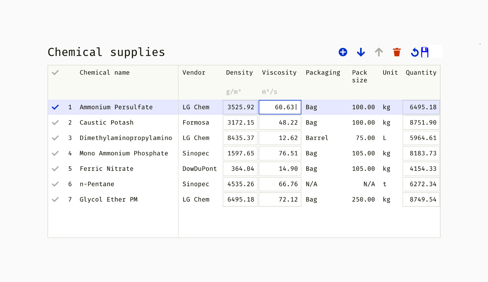

# Documentation IITB (PWA) 
 
> Documentation for the chemical supplies pwa, designed as shown below. This README is your comprehensive guide to understanding the project's architecture, technology stack,page structure and my approach.



# Table of Contents

- [Overview](#overview)
- [Tech Stack](#technology-stack)
- [Project Structure](#project-structure)
- [Functionality](#functionality)

# Overview

> App constitutes of two parts:
* <pre>
    Table: It consists of all the chemical data in rows which can be manipulated (edit, delete, move up, move down) once the row is selected using the first cell.
</pre>
* <pre>
    Tools: It is a global tool set to functionally manipulate those table rows data. It consists of following features:
    <ul>
        <li>Add: To add new row data to the table (initially highlighted at the top of the table)</li>
        <li>Edit: To edit the row data of the table</li>
        <li>Move Down: To move data of the table down row-wise</li>
        <li>Move Up: To move data of the table up row-wise</li>
        <li>Delete: To delete the row data entry (entire row or multiple rows)</li>
        <li>Refresh: To bring the table to the original state (with initial data entries, not exactly specified its functionality in assignment)</li>
        <li>Save: To save the draft data once edited or once new entry is added</li>
    </ul>
</pre>

# Technology Stack

> This PWA is built using a well-considered technology stack, ensuring reliability and efficiency:


## Language:
- **JavaScript (JS, ES6)**[link](https://developer.mozilla.org/en-US/docs/Web/JavaScript)


## Styling:
- **Local CSS**[link](./css/style.css)

## Deployment:
- **Netlify**[link](https://iitb-pwa-assignment.netlify.app/)


# Project Structure
```plaintext
├───css
│   └───style.css
├───images
│   └───icons
├───js
├───├───app.js
├───├───tools.js
│   └───utils.js
├───chemicals.json
├───index.html
├───manifest.json
├───README.md
└───serviceWorker.js
```
# Functionality


## Contact

- **Email:** [giteshchauhan20@gmail.com](mailto:giteshchauhan20@gmail.com)


